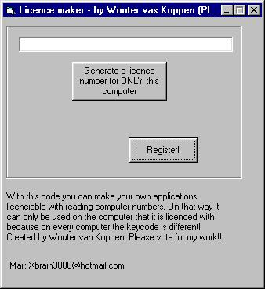



## Login code \- UPDATED\!\!\! reads your MAC address

### Description

It reads your MAC address and converts it to a keycode. Then the program will ask you a keyode for a licence and checks if these are the same. When they are the same, you have a licence.

On every computer the keycode is different because the MAC addresses are different!!!

Good code for distributing your program if you don't want that it will be used by unregistered users!
 
### More Info
 

             |
---                |---
**Submitted On**   |2003-01-12 09:31:04
**By**             |[\[Wouter van Koppen\]](https://github.com/Planet-Source-Code/PSCIndex/blob/master/ByAuthor/wouter-van-koppen.md)
**Level**          |Intermediate
**User Rating**    |5.0 (15 globes from 3 users)
**Compatibility**  |VB 6\.0
**Category**       |[Windows API Call/ Explanation](https://github.com/Planet-Source-Code/PSCIndex/blob/master/ByCategory/windows-api-call-explanation__1-39.md)
**World**          |[Visual Basic](https://github.com/Planet-Source-Code/PSCIndex/blob/master/ByWorld/visual-basic.md)
**Archive File**   |[Login\_code1527831122003\.zip](https://github.com/Planet-Source-Code/wouter-van-koppen-login-code-updated-reads-your-mac-address__1-42276/archive/master.zip)

